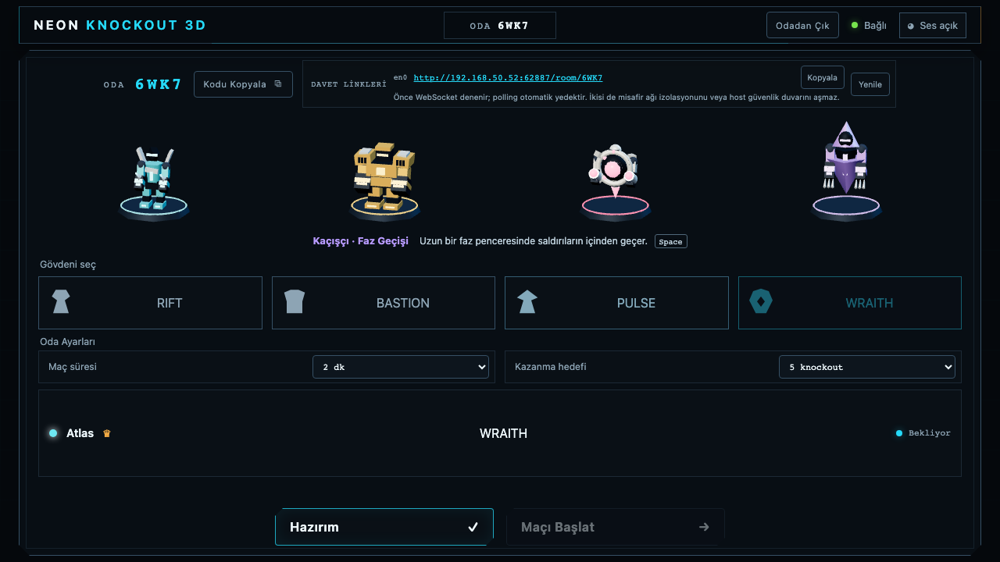

# Neon Knockout 3D

A standalone Three.js **2.5D LAN arena brawler**, derived from [Neon Knockout](https://github.com/reitenji/neon-knockout). The game uses an orthographic 3D camera and four original articulated robot models while combat remains on a flat, server-authoritative plane. Menus and controls are in Turkish. All art and audio ship locally; no Internet service is required during play.



## Fighters

| Fighter | Play style | Space ability | Tradeoff |
| --- | --- | --- | --- |
| RIFT | Agile duelist; bladed arms and articulated running | Yarık Hücumu: 900-unit/s rush, 1.3 s cooldown | Fast movement requires careful edge control |
| BASTION | Broad armored brawler; planted steps and heavy gauntlets | Zırhlı İlerleyiş: armored advance, 1.7 s cooldown | Slower movement; 35% less normal knockback, 70% less during the advance |
| PULSE | Floating reactor; orbital machinery and emitter arms | Radyal Darbe: 125-unit radial repulsion at dash start, 1.8 s cooldown | Shorter invulnerability window; burst obeys protection and hit-credit rules |
| WRAITH | Hooded spectral machine; gliding motion and claws | Faz Geçişi: 190 ms phase protection, 1.55 s cooldown | Receives 12% more knockback when hit |

Keyboard and touch use the same authoritative rules. Every accepted activation has a cooldown; holding Space does not repeat the ability. Incoming attacks can be dodged during the character's invulnerability window; BASTION instead resists knockback.

## Run on the same Wi-Fi

```sh
npm ci
npm run lan
```

Use Node.js 20 or newer. The host command builds the production client and starts the game server. It prints a localhost URL for the host machine and a private LAN URL for players on the same network. Open the printed LAN URL from another browser; do not replace it with a public address. Neon Knockout does not provide WAN, Internet matchmaking, accounts, or a relay service.

## Host and join

1. On the host computer, run the two commands above.
2. The host opens the printed `http://localhost:4175` URL, enters a name, and chooses **Oda Kur**.
3. Copy the appropriate **Davet Linkleri** URL shown in the host lobby and share it with up to seven friends. The link already contains the room code, for example `http://192.168.1.20:4175/room/AB2Z`. Use **Yenile** if the host changes network.
4. Each friend opens that exact link, enters only a player name, chooses **Odaya Katıl**, and selects a chassis. The four-character room code remains available as a manual fallback from the main page.
5. The host chooses the room rules, every player chooses **Hazırım**, and the host chooses **Maçı Başlat** when every connected player is ready.

The local host may use `http://localhost:4175`; other devices must use the private LAN URL shown in the lobby, commonly in `192.168.x.x`, `10.x.x.x`, or `172.16–31.x.x`. Allow incoming TCP connections on port 4175 and UDP ports 53140–53171 in the operating-system firewall when players cannot join or WebRTC cannot activate. Guests only need a modern browser after the host has installed dependencies.

## Gameplay transport and Ping

Socket.IO remains connected for room and session control. During a match, a supported browser tries a host-candidate-only WebRTC connection directly to the authoritative Node.js server over UDP 53140–53171. This is a LAN-only path: it uses no STUN, TURN, public relay, or Internet traversal. If the browser, firewall, or network cannot establish WebRTC, gameplay automatically continues through the current Socket.IO WebSocket or polling connection without reloading or leaving the room.

The UDP range can be overridden when the default conflicts with local policy. Set both bounds and keep them different, for example:

```sh
GAME_WEBRTC_UDP_PORT_MIN=54000 GAME_WEBRTC_UDP_PORT_MAX=54031 npm run lan
```

The player list intentionally shows one **Ping** value measured on the transport carrying gameplay. While WebRTC is active, Node sends a generation-bound nonce over the same unordered `match-fast` DataChannel as snapshots and times its matching browser acknowledgement on the server clock. The reliable DataChannel heartbeat remains separate and is used only to detect a dead connection. During Socket.IO fallback, Node sends one lightweight nonce per second over the same active WebSocket or polling connection and times only the matching acknowledgement; snapshot delivery stays separately acknowledgement-paced and latest-wins so stale frames cannot form a reliable queue. These application RTTs include browser and Node scheduling as well as transport time; only fresh, matching, server-owned samples enter the displayed median, which remains `—` until one exists. Ping is not rendering delay, rollback, an ICMP estimate, or a client-submitted value, and the game does not promise a universal sub-20 ms result on every Wi-Fi network.

Only the current host can edit **Oda Ayarları**. Match duration can be **90 sn**, **2 dk**, or **3 dk**; the winning target can be **3**, **5**, **7**, or **10** knockouts. New rooms default to two minutes and five knockouts. Guests see the same server-owned values in read-only controls. A real settings change clears every player's ready state, and the selected pair persists through reconnects, host migration, returns to the lobby, and rematches.

## Controls

- `WASD`: move and aim, including normalized diagonals; releasing movement retains the last aim direction
- `J`: quick attack on each new key press
- Hold `K`: charge a heavy strike while steering with `WASD`; release `K` to attack
- `Space`: the selected fighter’s movement ability (also the touch Dash button)

Arrow keys, both `Shift` keys, mouse movement, and mouse buttons do not control the fighter. Each chassis now has its own movement speed, Space ability, cooldown, and resistance. The first player to the room's configured knockout target wins; a normal knockout returns control in 600 ms, resets overload, and does not add any escalating penalty.

On touch devices, menus and the lobby work in portrait. Rotate to landscape for the match, then use the left joystick to move and aim. The right-side buttons perform quick attack, charge heavy while held and release it when lifted, and dash. Losing focus, rotating, or canceling a touch clears held controls so an action cannot remain stuck.

## Combat and match pacing

A heavy becomes available after 180 ms of charge. Releasing before the full 700 ms produces a melee-only heavy; reaching 700 ms also launches exactly one server-owned **Neon Pulse** in the locked direction. Pulses can hit a fighter or be broken by an active melee sweep. Equal quick attacks clash, equal heavies clash with stronger recoil, and a heavy defeats a quick without canceling the heavy. The first attack avoided during a dash is a **perfect dodge** and refunds part of that dash cooldown.

A regulation match lasts for the host-selected 90, 120, or 180 seconds. Arena contraction keeps the same pacing at every duration: warning/start/minimum happen at 58.5/56.25/30 seconds remaining for a 90-second match, 78/75/40 for the default 120-second match, and 117/112.5/60 for a 180-second match. A tied regulation result enters minimum-arena sudden death; only the next credited knockout wins, while an uncredited self-fall does not end the match.

## Reconnect behavior

Closing or losing a browser connection does not award a knockout or a fall. Keep the same tab open and the client automatically resumes its stored room identity when it reconnects during the grace window. Reloading the same `/room/CODE` invite also resumes that room, while opening a different room invite never resumes an unrelated stored room first. If a player cannot return before that window expires, the remaining match may be declared no contest rather than treating the disconnect as a score.

## Leaving a room

**Odadan Çık** is available once in the top bar during the lobby, match, and result screens. A successful leave returns that player to the landing screen, removes the old room's resume authority, and keeps the live connection ready to create or join another room. If the host leaves, ownership moves to the earliest connected remaining player without changing the room rules; if the final player leaves, the room is removed. During an active match, a viable remaining group continues, while a population that can no longer support a match returns immediately to the lobby as no contest. Leaving from a result returns the remaining players to the lobby with the same settings and reset ready states.

## Platform notes

- macOS: allow the terminal or Node.js application through the firewall if macOS asks, and ensure any managed or third-party firewall permits inbound TCP 4175 plus UDP 53140–53171.
- Windows: allow Node.js on private networks in Windows Defender Firewall. A scoped UDP rule can be added from an elevated terminal with `netsh advfirewall firewall add rule name="Neon Knockout WebRTC" dir=in action=allow protocol=UDP localport=53140-53171 profile=private`.
- Linux: allow TCP 4175 and UDP 53140–53171 on the active private-network firewall profile; with UFW, use `sudo ufw allow 4175/tcp` and `sudo ufw allow 53140:53171/udp`.

If the LAN URL is absent, make sure the host has an active private network adapter. VPN, guest Wi-Fi/client isolation, captive portals, and corporate firewalls can block host candidates or all direct LAN connections. A guest network may let devices reach the Internet while deliberately preventing them from reaching each other; WebRTC and Socket.IO cannot bypass that policy. WebRTC falls back to Socket.IO when only UDP is blocked, and Socket.IO prefers WebSocket before polling, but none of these transports can bypass router isolation or a closed host firewall. Stop an older local server already using port 4175 before running `npm run lan`.

## Health probe and troubleshooting

The host can confirm the server is listening with:

```sh
curl --fail http://127.0.0.1:4175/health
```

It returns JSON with `status: "ok"` and the current room count. Also run the same `/health` request against the exact private address shown in the lobby or printed by `npm run lan`, for example `curl --fail http://192.168.1.20:4175/health`; do not guess or hardcode that address. Both requests must return HTTP 200. If the host probe works but a guest cannot connect, verify both devices are on the same private network, avoid an isolated guest Wi-Fi, use the displayed LAN URL exactly, and check the firewall rule.

## Verification

```sh
npm run lint
npm run typecheck
npm test
npm run test:load
npm run build
npm run test:e2e
npm run test:e2e:webkit
npm run verify
npx vitest run tests/integration/socketFlow.test.ts --maxWorkers=1
```

`npm run verify` runs lint, both TypeScript checks, all Vitest suites, the ten-second eight-client Socket.IO fallback load gate, and a production build. `npm run test:e2e` builds production code and runs the Chromium suite plus one isolated iPhone-like Playwright WebKit smoke; Chromium-only CDP touch and performance tests are not rerun on WebKit. The browser gates cover active Chromium-to-Node WebRTC gameplay, forced fallback without reload, a fresh lobby/rematch generation, unsupported-browser fallback, mobile landscape touch input, the representative frame/ring-out gates, and WebKit mobile create/join/start with one trusted touchscreen tap correlated to the exact `quick` input, WebRTC acceptance sequence, and single authoritative attack. Run `npx playwright install webkit` once if the WebKit runtime is absent; `npm run test:e2e:webkit` then runs only that production-build smoke. This is automated Playwright WebKit coverage, not acceptance on a physical iPhone or the shipping Safari application. The performance run uses one real 1280 × 720 WebRTC renderer with seven active lightweight Socket.IO participants and 60 exact input samples per transport. It enforces median FPS >= 58, p95 frame time < 25 ms, same-host median input-to-authoritative acceptance <= 20 ms, and same-host p95 < 40 ms. Physical-phone Wi-Fi remains a separate acceptance observation rather than being inferred from the local browser gate.


## 3D implementation and validation

The Three.js renderer lives in `src/client/game/three/`. Fighter geometry uses authored mesh/pivot hierarchies; motion separates visual limbs from server hitboxes. `src/client/game/runtime/` contains renderer-independent input, prediction session and audio code. `src/shared/fighters.ts` is the source of truth for character abilities, and the same movement definitions are used by server simulation and local prediction. Phaser is not a runtime dependency.

The initial release validates same-host independent browser clients, WebRTC/Socket.IO paths, touch controls and an eight-player scene. This is not a claim of testing a separate physical phone or laptop. Use the host's printed LAN address on a second device for physical Wi-Fi acceptance.

The new game defaults to TCP **4175** and WebRTC UDP **53140–53171**, separate from the original game's default ports. `PORT`, `GAME_WEBRTC_UDP_PORT_MIN`, and `GAME_WEBRTC_UDP_PORT_MAX` can override these when needed. See `docs/acceptance-3d.md` for the recorded checks.
